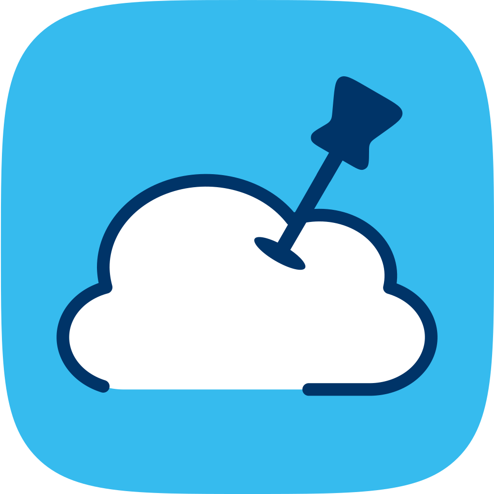

# AzPin

[](https://github.com/lfmundim/AzPin/releases/latest)
%22&replace=v%241&label=brew)
[](https://github.com/lfmundim/AzPin/releases/latest)
[](https://snapcraft.io/azpin)

<p align="center">
  
</p>

AzPin is a native macOS menubar app that reads your existing `az` CLI session and gives you fast, pinnable access to Azure resources. Open the menubar, see your pinned resource groups and their live resources, click to open in the portal, or start/stop/restart runnable resources without leaving the desktop.

There is also a WinUI 3 Windows port under `src/windows/`, distributed as a self-contained zip from GitHub Releases, and a native GTK4 GNOME Linux port under `src/ubuntu/` distributed as a `.deb` package.

No Azure SDK. No App Store. No sandbox. Requires macOS 26 Tahoe, Windows 11, or GNOME Linux.

---

## Prerequisites

- **macOS 26 Tahoe** or later | **Windows 11** or later | **GNOME Linux** (Developed and tested on Ubuntu 26.04 using GNOME 46; in theory, it is compatible with any Linux distribution using the GNOME UI.)
- **[Azure CLI](https://learn.microsoft.com/en-us/cli/azure/install-azure-cli?view=azure-cli-latest)** installed
- Signed in: `az login`

---

## Install

### macOS - Homebrew (recommended)

```bash
brew tap lfmundim/tap
brew install --cask azpin
```

### macOS - DMG (manual)

Download the latest `.dmg` from [Releases](../../releases), drag `AzPin.app` to `/Applications`.

### Windows - Winget (recommended, not yet available)

```powershell
winget install KimDim.AzPin
```

### Windows - MSI (manual)

Download the latest `AzPin-Windows-*-Installer.msi` from [Releases](../../releases) and run it.

> **Note:** The installer is self-signed. Your browser and Windows SmartScreen may flag it as unrecognized. Click **More info → Run anyway** (SmartScreen) or keep the file if your browser warns. The app is safe to install. If there is enough demand, a recognized certificate may be obtained in the future.

No separate Windows App SDK runtime is required — the bundle is self-contained.

### GNOME Linux - DEB (manual)

Download the latest `AzPin-Ubuntu-*-v*.deb` from [Releases](../../releases) and install it:
```bash
sudo apt install ./AzPin-Ubuntu-x64-v1.0.0.deb
```

### GNOME Linux - Snap

If you install via the Snap Store, you **must** manually grant AzPin permission to read your `~/.azure/` configuration folder so it can access your active `az login` session. Run this once after installation:
```bash
sudo snap install azpin
snap connect azpin:dot-azure
```

---

## How Pinning Works

**Pin an entire resource group** — all current and future resources in that RG appear in the menubar on every open. New resources show up automatically.


**Pin individual resources** — only those specific resources appear, even if their parent RG is not pinned.


Both modes coexist. If a resource is individually pinned and its parent RG is also pinned, it appears once (deduplication by resource ID). 

---

## MacOS Menubar / Windows TaskBar

Click the `☁` icon in the menubar to see:

1. Signed-in account and active subscription
2. Pinned resource groups, each expandable to show live resources
3. Runnable resources (App Services, Function Apps, Container Apps, Logic Apps) with a submenu for Start / Stop / Restart
4. Individually-pinned resources not belonging to a pinned RG — runnable ones show the same Start/Stop/Restart submenu as RG resources
5. Quick access to open the main window or quit


---

## Main Window

Open via **Open AzPin...** in the menubar or `⌘Space → AzPin`.

- **Sidebar**: pinned RGs, drag to reorder, right-click to unpin or open in Portal
- **Pinned tab**: individually-pinned resources for the selected RG, reorderable
- **Browse tab** (RG selected): live resources within that specific RG, sorted by type, with pin buttons
- **Browse view** (nothing selected): subscription picker and search field share a single toolbar row — browse all RGs and resources, pin whole RGs or individual resources
- **Settings → Subscriptions**: hide subscriptions you don't want cluttering the Browse picker

---

## Build from Source

### macOS

Requires Xcode 26+ and the Xcode command-line tools.

```bash
# Debug build
xcodebuild -scheme AzPin -configuration Debug build | xcbeautify

# Run tests
xcodebuild -scheme AzPin -configuration Debug test | xcbeautify

# Release archive
xcodebuild -scheme AzPin -configuration Release \
  -archivePath build/AzPin.xcarchive archive | xcbeautify
```

### Windows

Requires .NET 10 SDK and the Windows App SDK workload.

```powershell
# Restore
dotnet restore src/windows/AzPin.Windows/AzPin.Windows.csproj -p:Platform=x64

# Debug build
dotnet build src/windows/AzPin.Windows/AzPin.Windows.csproj -c Debug -p:Platform=x64

# Run tests
dotnet test src/windows/AzPin.Windows.sln

# Self-contained release bundle
dotnet publish src/windows/AzPin.Windows/AzPin.Windows.csproj `
  -c Release -r win-x64 -p:Platform=x64 `
  -p:WindowsAppSDKSelfContained=true --self-contained true `
  -o build/publish/win-x64
```

### GNOME Linux

Requires Rust and GTK4 development libraries.

```bash
# Install dependencies
sudo apt-get install libgtk-4-dev libadwaita-1-dev libayatana-appindicator3-dev

# Build and run
cd src/ubuntu/AzPin
cargo run

# Build DEB package
cargo install cargo-deb
cargo deb
```

---

## Contributing

1. Fork and clone.
2. Create a feature branch off `main`.
3. Follow the rules in `CLAUDE.md` — especially: no Azure SDK, no hardcoded colors, no paid dependencies, tests for every service method.
4. Open a PR against `main`.

---

## Key Docs

| File | Purpose |
|---|---|
| `CLAUDE.md` | Architecture rules and hard constraints |
| `AZPIN_SPEC.md` | Full product specification |
| `CHANGELOG.md` | Release history |
| `ROADMAP.md` | Planned future features |
| `RELEASE_PROCESS.md` | How to cut a release |

---

## License

[MIT](LICENSE)
